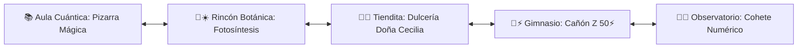

# 🤖 ARA BOT de Mate • PWA Mundo Toca Boca & Juegos Escolares (v5.3.0)

> **PWA interactiva de mundo abierto escolar estilo Toca Life / Avatar World / Habbo con personajes interactivos arrastrables (Nonina 🌸, Doydo 💙, ARA BOT 🤖, Lolita 🐰 y Bruno 🐶), Rincón de Fotosíntesis 🌿☀️, La Dulcería Mágica de Doña Cecilia 🍬 (resolución de la tarea oficial SEP de 2.° Grado), Menú de Hexágonos Neón ⬢ y minijuegos temáticos.**  
> **Disponible online y 100% offline en [https://coloapp.github.io/Juegos_Escolares/](https://coloapp.github.io/Juegos_Escolares/)**

---

## 🏫 1. Mundo Abierto Interactivo (Patio Escolar Panorámico)

El patio cibernético cuenta con desplazamiento horizontal fluido (`touch-pan-x`) y 5 áreas temáticas conectadas:

### 🌿☀️ Rincón de Botánica (Misión Fotosíntesis)
- **Foco Pedagógico:** Ciencias Naturales y Biología Primaria.
- **Mecánica Interactiva:** Experimento interactivo donde el alumno riega la planta con la regadera mágica 💧 y la expone a la luz solar nutritiva ☀️ para completar la reacción química:  
  $$\text{Agua } (\text{H}_2\text{O}) + \text{Luz Solar} + \text{Dióxido de Carbono } (\text{CO}_2) \longrightarrow \text{Glucosa } (\text{Nutrientes 🍯}) + \text{Oxígeno } (\text{O}_2 \text{ 🫧})$$
- Genera partículas de oxígeno y energía vegetal con retroalimentación inmediata de ARA BOT 🤖.

### 🍬🏪 Puesto de Dulces de Doña Cecilia
- Puesto físico en el patio para entrar directamente al taller y minijuego de conteo y empaque.

---

## 🌌 2. Menú de Juegos de Doydo (Hexágonos Flotantes Neón ⬢)

Modal holográfico con hexágonos táctiles para **2.° Grado (Ricardo / Doydo)**:

### 🟢 Hexágono 1: "Laboratorio Dinosaurio (Escape del T-Rex 🦖)"
- **Foco:** Descomposición Base-10 (Centenas 🔴, Decenas 🟢, Unidades 🔵) y el Valor Posicional del Cero.
- **Mecánica:** 9 Puertas de contención (`378, 642, 195, 814, 250, 937, 409, 763, 581`), 3 búnkers con auto-bloqueo 🔒, compuertas de titanio 💥 y reactor de fusión Base-10.

### 🔴🔵 Hexágono 2: "El Cañón de Sumas RÁPIDAS (Luchadores Z) 🥊"
- **Foco:** Sumas y cálculo mental rápido con fuerzas hasta 50⚡.
- **Mecánica:** Modos ⚡ Rápido y 🧠 Estrategia (cargas de +10, +5, +1), enemigos robóticos (Chispas Z-1, Cyber-Bípode Z-2, Mecha-Titan Z-3, Electro-Destructor Z-4, Mega-Bot Alfa Z-5) y explosión de tuercas ⚙️💥.

### 🟡 Hexágono 3 (NUEVO): "La Dulcería Mágica de Doña Cecilia 🍬"
- **Foco:** Descomposición, empaque y agrupación en Unidades, Decenas y Centenas (Basado en la Tarea SEP 2.° Grado).
- **Mecánica de Empaque Base-10:**
  - $1$ Dulce suelto 🍬 = $1$ Unidad (🔵 Azul).
  - $10$ Dulces sueltos 🍬 $\rightarrow$ $1$ Bolsa 🛍️ ($10$ / Decena - 🟢 Verde).
  - $10$ Bolsas 🛍️ $\rightarrow$ $1$ Caja 📦 ($100$ / Centena - 🟡 Amarillo Oro).
- **Los 4 Ejercicios de la Tarea SEP:**
  1. *Contar Empacados (Don Ramón):* "3 Cajas y 6 Bolsas" $\rightarrow 3 \times 100 + 6 \times 10 = \mathbf{360 \text{ dulces}}$.
  2. *Descomponer Número (Pedido 520):* "Pedido de 520 dulces" $\rightarrow \mathbf{5 \text{ Cajas y } 2 \text{ Bolsas}}$.
  3. *Agrupar Decenas (Pedido 45 Bolsas):* "Recibe 45 bolsas" $\rightarrow 45 \text{ bolsas} = \mathbf{4 \text{ Cajas y } 5 \text{ Bolsas (450 dulces)}}$.
  4. *Conteo de Bodega:* "Tiene 6 Cajas y 15 Bolsas" $\rightarrow 600 + 150 = \mathbf{750 \text{ dulces en total}}$.
- **Asistencia con Código de Colores ARA BOT 🤖:** Centenas/Cajas (🟡 Amarillo), Decenas/Bolsas (🟢 Verde), Unidades/Dulces (🔵 Azul) para evitar confusiones de lectura.

---

## 🚀 3. Menú de Juegos de Nonina (3.er Grado)

Modal para **Romina / Nonina**:
- 🌸 **El Cohete Numérico 🚀:** Series de 5 en 5, odómetro de 4 cifras (🟡 Millares, 🔴 Centenas, 🔵 Decenas, 🟢 Unidades) y altímetro espacial a 10,000 M.
- 📐 **Pizarra Mágica Cuántica:** Cálculo mental flash, tizas de colores, sumas, restas y tablas de multiplicar con multiplicador de combo.

---

## 🐾 4. Personajes Interactivos y Mochila

- **Nonina 🌸:** Avatar animado con uniforme escolar y lazo rosa.
- **Doydo 💙:** Avatar animado con gorra azul y rayo relámpago.
- **ARA BOT 🤖:** Robot flotante que brinda pistas pedagógicas.
- **Lolita 🐰:** Conejita con orejas tiernas.
- **Bruno 🐶:** Border Collie fiel con pecho blanco y pata delantera blanca.
- **Física de Arrastre & Alimentación:** Arrastra dulces 🍬, pizza 🍕, zanahorias 🥕 y agua 💧 hacia cualquier personaje para ver reacciones y corazones.

---

## 🛠️ 5. Requisitos Técnicos y Arquitectura PWA

- **Single Screen Zero-Scroll View:** Vista fija en `100dvh` optimizada para tablets y smartphones sin desbordamiento vertical.
- **100% Offline (Web Audio API):** Síntesis de ondas de sonido senoidales/cuadradas generadas directamente en el navegador sin dependencias de archivos externos.
- **Auto-Update Engine (Network-First):** Verificación automática de `version.json` con purgado de Service Worker y actualización instantánea.

---

## 👨‍👧‍👦 Dedicatoria

Creado con amor para **Romina (Nonina)** y **Ricardo (Doydo)**. ¡Aprender jugando en su propio universo escolar interactivo! 🏫🌸💙

