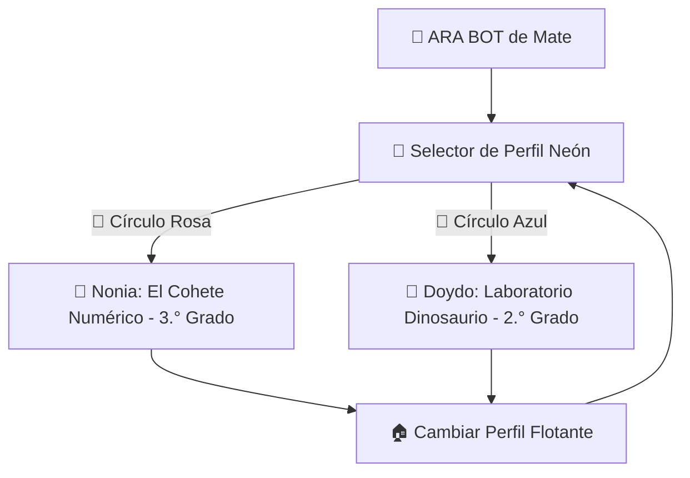

# 🤖 ARA BOT de Mate • Progressive Web App (PWA)

[](https://web.dev/progressive-web-apps/)
[](#)
[](#)
[](#)
[](#)
[](#)

> **Plataforma interactiva de gamificación matemática infantil diseñada para Romina (Nonia) y Ricardo (Doydo). Construida con HTML5, CSS3 moderno (Tailwind CSS), JavaScript Vanilla y Web Audio API sin dependencias externas pesadas.**

---

## 🌟 Visión General

**"ARA BOT de Mate"** es una Progressive Web App (PWA) de alto impacto visual y sensorial con estética **Cyberpunk / Neón Educativo**. Diseñada para ejecutarse en una sola pantalla sin desplazamiento vertical (**Single Screen Zero-Scroll**), permite a los estudiantes de primaria experimentar el valor posicional y la descomposición numérica a través de la experimentación lúdica táctil y auditiva.



---

## 🧠 Enfoque Pedagógico y Didáctico

La aplicación implementa los más altos estándares pedagógicos de la educación matemática contemporánea:

### 1. Modelo CPA (Concreto ➔ Pictórico ➔ Abstracto) de Singapur
- **Fase Concreta / Manipulativa:** Los niños tocan e interactúan con bloques individuales de unidades, barras de decenas, placas de centenas y cubos de millar.
- **Fase Pictórica:** El reactor y la fábrica muestran la agrupación física (10 cubos uniéndose en una barra; 10 barras en una placa).
- **Fase Abstracta:** Se conecta directamente con la expresión numérica formal y la suma posicional:
  $$\text{Número} = (\text{Millares} \times 1000) + (\text{Centenas} \times 100) + (\text{Decenas} \times 10) + (\text{Unidades} \times 1)$$

### 2. Estilo de Aprendizaje VAK (Visual - Auditivo - Kinestésico)
- **Visual:** Luces neón, código de colores estandarizado por valor, medidores de altura y compuertas mecánicas.
- **Auditivo:** Sonidos sintetizados en tiempo real para bips de conteo, alertas de alarma 🚨, rugido del T-Rex 🦖, explosiones de fusión y fanfarrias de victoria.
- **Kinestésico:** Interacción táctil inmediata, botones reactivos con micro-animaciones y retroalimentación instantánea.

### 3. Alineación Curricular (SEP Primaria)
- **2.° Grado:** Descomposición de números de 3 cifras hasta 1,000, comprensión del valor del cero intermedio y final (`250`, `409`).
- **3.er Grado:** Conteo por saltos numéricos (series de 5 en 5, 10 en 10, etc.) y construcción de números hasta los millares ($10,000$).

---

## 🎮 Módulos de Juego

### 1. 🎨 Pantalla de Inicio: Selector de Perfil Neón
- Fondo oscuro cibernético con rejilla y partículas ambientales.
- **🌸 Círculo Rosa Neón - Nonia (Romina):** Acceso al tablero de 3.er Grado (*El Cohete Numérico*).
- **💙 Círculo Azul Neón - Doydo (Ricardo):** Acceso al tablero de 2.° Grado (*Laboratorio Dinosaurio: Escape del T-Rex*).
- **🏠 Botón Global Flotante:** Permite alternar perfiles en cualquier momento sin perder la sesión.

---

### 2. 🚀 Nonia (Romina): "El Cohete Numérico" (3.° Grado)
- **Propósito:** Automatizar el conteo en series numéricas y construir la comprensión de números de hasta cuatro cifras.
- **Componentes:**
  - **Altímetro Espacial y Cohete:** Medidor vertical que escala de 0% a 100% conforme se acumulan puntos.
  - **Odómetro Posicional:**
    - 🟡 **Millar** (Amarillo / Oro)
    - 🔴 **Centena** (Rojo)
    - 🔵 **Decena** (Azul)
    - 🟢 **Unidad** (Verde)
  - **Fábrica Base-10 con Portal Mágico:** Generación de bloques animados con bips ascendentes al presionar `🚀 ¡SUMAR +5!`.
  - **Salto Numérico Configurable:** Selector de incrementos (+1, +2, +5, +10, +50, +100).
  - **Despegue con Partículas:** Animación de fuego y modal de ARA BOT explicando la descomposición posicional del número alcanzado.

---

### 3. 🦖 Doydo (Ricardo): "Laboratorio Dinosaurio: Escape del T-Rex" (2.° Grado)
- **Propósito:** Consolidar la descomposición de centenas, decenas y unidades con tareas escolares reales.
- **Ambientación:** Alarma roja parpadeante 🚨, rugido del T-Rex animado en su jaula de contención y panel de seguridad.
- **Reactor de Fusión Base-10:**
  - Botón interactivo para fusionar $10$ Unidades Azules 🔵 ➔ $1$ Decena Verde 🟢.
  - Botón interactivo para fusionar $10$ Decenas Verdes 🟢 ➔ $1$ Centena Roja 🔴.
- **Sistema de 9 Puertas de Contención:**
  | Puerta / Nivel | Código de Seguridad | Descomposición Requerida | Foco Pedagógico |
  |:---:|:---:|:---:|:---|
  | **1** | `378` | 3🔴 + 7🟢 + 8🔵 | Tutorial asistido con ARA BOT |
  | **2** | `642` | 6🔴 + 4🟢 + 2🔵 | Descomposición estándar |
  | **3** | `195` | 1🔴 + 9🟢 + 5🔵 | Decena alta (90) |
  | **4** | `814` | 8🔴 + 1🟢 + 4🔵 | Centena alta y decena básica |
  | **5** | `250` | 2🔴 + 5🟢 + 0🔵 | **¡Cero unidades!** Comprensión del valor posicional nulo |
  | **6** | `937` | 9🔴 + 3🟢 + 7🔵 | Centena máxima de nivel |
  | **7** | `409` | 4🔴 + 0🟢 + 9🔵 | **¡Cero decenas!** Reto crítico de valor posicional |
  | **8** | `763` | 7🔴 + 6🟢 + 3🔵 | Consolidación intermedia |
  | **9** | `581` | 5🔴 + 8🟢 + 1🔵 | Puerta final de escape |
- **Animación de Bloqueo:** Al acertar el código, la **Compuerta de Titanio azota con impacto metálico 💥** frente al T-Rex.
- **La Lección Secreta de ARA BOT:** Al completar los 9 niveles, ARA BOT presenta la regla nemotécnica matemática:
  - 🔵 **Unidades:** Valen $1$ (sin ceros adicionales).
  - 🟢 **Decenas:** Se les agrega **UN CERO** ($10$).
  - 🔴 **Centenas:** Se les agregan **DOS CEROS** ($100$).

---

## 🔊 Sintetizador Web Audio (100% Offline)

Toda la experiencia sonora está generada en tiempo real mediante **Web Audio API** nativo, garantizando que el juego no requiera descargar archivos de audio externos:
- **Sirena de Alarma:** Oscilador de onda de sierra con modulación periódica de frecuencia.
- **Rugido de T-Rex:** Oscilador sub-grave modulado con decaimiento dinámico.
- **Impacto de Compuerta de Titanio:** Onda cuadrada con golpe de transitorio y reverberación sintética.
- **Fusión Base-10:** Arpegios ascendentes en onda triangular/senoidal.
- **Bips de Conteo:** Pulsos senoidales escalonados por tono.

---

## 📱 Instalación como PWA

### En Celulares y Tablets (Android / Chrome)
1. Abre la aplicación en el navegador Google Chrome.
2. Toca el botón emergente **"Instalar"** o pulsa los 3 puntos del navegador y selecciona **"Agregar a la pantalla principal"**.
3. La app se instalará como una aplicación nativa con icono propio y funcionará completamente sin conexión a internet.

### En iPhone y iPad (iOS / Safari)
1. Abre la aplicación en **Safari**.
2. Toca el botón **Compartir** (<i class="fa-solid fa-share-from-square"></i>).
3. Selecciona **"Añadir a la pantalla de inicio"**.

### En Escritorio (Windows / Mac / Linux)
1. En Chrome o Edge, haz clic en el icono de instalación en la barra de direcciones (`⊕`).
2. Disfruta de la app en modo ventana independiente sin barras de navegador.

---

## 🚀 Despliegue en GitHub Pages

Para publicar este proyecto de forma gratuita en GitHub:

1. Crea un repositorio en GitHub (ej. `juegos-escolares-ara-bot`).
2. Sube los archivos del proyecto:
   ```bash
   git add .
   git commit -m "feat: Lanzamiento PWA ARA BOT de Mate v2.5"
   git branch -M main
   git push -u origin main
   ```
3. En tu repositorio de GitHub, ve a **Settings** ➔ **Pages**.
4. En **Build and deployment > Branch**, selecciona `main` y la carpeta `/ (root)`.
5. Haz clic en **Save**. En unos segundos, tu PWA estará disponible en `https://<tu-usuario>.github.io/<tu-repo>/`.

---

## 📁 Estructura del Repositorio

```text
├── index.html          # Aplicación única ejecutable (HTML5, Tailwind, CSS, JS, Web Audio)
├── manifest.json       # Manifiesto PWA para instalación standalone
├── sw.js               # Service Worker con caché offline (Cache-First)
└── README.md           # Documentación pedagógica y técnica completa
```

---

## 👨‍👧‍👦 Dedicatoria

Creado con amor por papá para **Romina (Nonia)** y **Ricardo (Doydo)**, para hacer de sus tareas escolares de matemáticas una aventura cibernética inolvidable. 🚀🦖🤖
