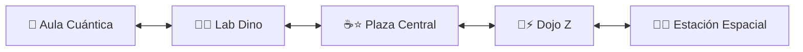

# 🤖 ARA BOT de Mate • PWA Mundo Toca Boca & Juegos Escolares

> **Plataforma interactiva de mundo abierto estilo Toca Life / Avatar World con desplazamiento horizontal panorámico, cajón de personajes y objetos arrastrables (comida que se consume, accesorios, juguetes matemáticos) y minijuegos educativos para NONINA 🌸 (Romina - 3.er Grado) y DOYDO 💙 (Ricardo - 2.º Grado).**  
> **Disponible online y 100% offline en [https://coloapp.github.io/Juegos_Escolares/](https://coloapp.github.io/Juegos_Escolares/)**

---

## 🗺️ 1. Mundo Panorámico Desplazable (5 Zonas Conectadas)

El juego cuenta con un escenario continuo horizontal con deslizamiento táctil (*touch swipe / drag-to-scroll*) y selector de salas rápido:

1. **🏫 Aula Cuántica / Escuela Matemática:**
   - Pizarra interactiva con tizas que generan operaciones matemáticas en vivo al tocarla.
   - Pupitres y mesas donde sentar a los avatares.
   - Mochila mágica que abre el inventario de objetos.
2. **🧪🦖 Laboratorio Dinosaurio & Bio-Robótica:**
   - Hábitat del dinosaurio **Rexi Bebé** (tócalo para acariciarlo o alimentarlo).
   - Mesa de pociones y reactor de fusión Base-10 (10 azules 🔵 ➔ 1 verde 🟢 / 10 verdes 🟢 ➔ 1 rojo 🔴).
   - Acceso directo al minijuego completo de las **9 Puertas de Contención T-Rex**.
3. **☕⭐ Plaza Central & Cafetería Cósmica:**
   - Fuente de gemas matemáticas con lluvia de partículas doradas.
   - Teclado sintetizador musical Z funcional con notas reales Web Audio API.
   - Mesas con bocadillos y máquina expendedora galáctica.
4. **🥊⚡ Dojo Z / Gimnasio Galáctico:**
   - Saco de boxeo interactivo que se balancea con sonido de impacto.
   - Robot sparring de entrenamiento con energía 50 ⚡.
   - Podio de medallas y trofeos dorados.
   - Acceso directo al minijuego **El Cañón de Sumas RÁPIDAS (Luchadores Z)**.
5. **🚀🌌 Estación Espacial & Plataforma de Despegue:**
   - Torre de lanzamiento con el **Cohete Numérico**.
   - Telescopio astronómico de constelaciones numéricas.
   - Acceso directo al minijuego **El Cohete Numérico (Series +5)**.

---

## 🎒 2. Cajón de Inventario y Físicas estilo Toca Boca

Al tocar el botón flotante 🎒 **"Cajón de Objetos"**, se despliega una bandeja con:
- **🧸 Pestaña Objetos & Comida:**
  - 🍕 *Comida Galáctica:* Pizza, dona neón, jugo de estrellas, helado de plasma.
  - 👄 *Física de Comer:* Arrastra la comida hacia la boca de Nonina o Doydo para ver la animación de masticar, sonido `ñam ñam` y corazones flotantes.
  - 🕶️ *Accesorios:* Gafas cyber, corona de estrellas, gorras.
  - 📱 *Juguetes:* Calculadora cuántica, trofeo dorado, pelota saltarina.
- **👥 Pestaña Personajes:**
  - Invoca o teletransporta a **Nonina 🌸**, **Doydo 💙**, **ARA BOT 🤖**, **Gato Bot 🐱** y **Mech Pup 🐶** a la sala actual.

---

## 🎮 3. Minijuegos Integrados

- 🚀 **El Cohete Numérico (Romina - 3.er Grado):** Series de 5 en 5, odómetro de 4 cifras (Millares 🟡, Centenas 🔴, Decenas 🔵, Unidades 🟢) y despegue a la estratosfera.
- 🦖 **Laboratorio Dinosaurio (Ricardo - 2.º Grado):** 9 compuertas con código holográfico, reactor Base-10 y lección secreta del cero.
- 🥊 **El Cañón de Sumas RÁPIDAS (Luchadores Z):** Combate contra robots descontrolados con fuerzas hasta 50 ⚡, modos Rápido/Estrategia y explosión de engranajes y tuercas ⚙️💥.

---

## 🔄 4. Motor de Actualización Automática Diaria (Auto-Update Engine)

Para garantizar que los niños y padres siempre vean los nuevos juegos y tareas publicadas diariamente **sin necesidad de limpiar la caché ni presionar Ctrl+Shift+R**:
- **Estrategia Network-First para Navegación:** El Service Worker (`sw.js`) prioriza siempre la versión más reciente del HTML en la red y solo recurre a la caché local cuando no hay conexión a internet.
- **Detección Automática con `version.json`:** Al abrir o volver a la pestaña, la aplicación compara la versión con el servidor en segundo plano (`fetch('version.json?t=...')` con `no-store`).
- **Recarga y Purgado Silencioso:** Si detecta una nueva versión de tareas, purga las cachés antiguas, despliega una notificación flotante (*"¡Nueva tarea diaria detectada! Actualizando... 🚀"*) y recarga la página automáticamente.
- **Botón Manual en el Menú:** Se incluye el botón 🔄 **"Actualizar"** en el dock flotante para forzar la sincronización instantánea en cualquier momento.

---

## 🛠️ Especificaciones Técnicas

- **Zero-Scroll Vertical:** `100dvh` fijo con deslizamiento horizontal suave.
- **100% Offline con Web Audio API:** Sintetizador de sonido poligonal nativo sin dependencias externas pesadas.
- **Asistente de Voz ARA BOT:** Integración con Web Speech API para lectura de textos y pistas matemáticas.
- **PWA Instalable & Auto-Actualizable:** Service Worker con registro `{ updateViaCache: 'none' }` y caché offline inteligente.

