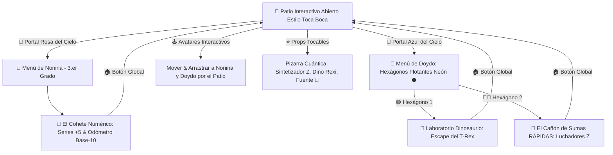

# 🤖 ARA BOT de Mate • Progressive Web App (PWA)

[](https://web.dev/progressive-web-apps/)
[](#)
[](#)
[](#)
[](#)
[](https://coloapp.github.io/Juegos_Escolares/)

> **Plataforma interactiva de gamificación matemática infantil diseñada con estética Cyberpunk Neón y entorno de mundo abierto estilo Toca Boca / Avatar World para NONINA 🌸 (Romina - 3.er Grado) y DOYDO 💙 (Ricardo - 2.º Grado).**  
> **Disponible online y 100% offline en [https://coloapp.github.io/Juegos_Escolares/](https://coloapp.github.io/Juegos_Escolares/)**

---

## 🌟 Arquitectura y Flujo de la Experiencia



---

## 🎮 1. Entorno Abierto e Interactivo (Mundo 2D estilo Avatar World / Toca Boca)

El juego inicia en un parque cyber-educativo lleno de vida con fondo dinámico de estrellas y partículas:
- **Avatares Interactivos (NONINA & DOYDO):**
  - **NONINA 🌸 (Romina - 3.er Grado):** Estilo cyber-girl con lazo rosa neón, remera con estrella y animaciones de pasos.
  - **DOYDO 💙 (Ricardo - 2.º Grado):** Estilo cyber-boy deportivo con gorra/pelo azul neón, insignia de rayo y animaciones de pasos.
  - **Movimiento Libre:** Los niños pueden tocar cualquier área del suelo para que el avatar camine hacia allí con indicador táctil tipo RPG, o arrastrarlos con el dedo / cursor.
  - **Burbujas de Diálogo y Voz:** Al tocar a los avatares, saltan con alegría, despliegan mensajes y ARA BOT habla en voz alta.
- **Props Interactivos del Patio:**
  - 📋 **Pizarra Holográfica Cuántica:** Toca para generar sumas y operaciones matemáticas en vivo.
  - 🦖 **Mascota Rexi Bebé:** Dinosaurio cibernético que baila y emite rugidos amistosos.
  - 🎹 **Sintetizador Musical Z:** Toca notas musicales synth reales polifónicas con Web Audio API.
  - 💎 **Fuente de Gemas Base-10:** Salpica partículas de oro, esmeralda y rubí.
  - 🤖 **ARA BOT Paseante:** Asistente robótico que acompaña a los niños con consejos didácticos.

---

## 🌌 2. Portales del Cielo y Menús Flotantes

En la parte superior del escenario flotan los portales galácticos:

### 💙 Menú de Doydo: Hexágonos Flotantes Mágicos Neón ⬢
Al tocar el portal azul de Doydo, se despliega el menú con hexágonos animados en CSS (`clip-path` y glow neón):
1. 🟢 **Hexágono Verde Neón 1:** *"Laboratorio Dinosaurio: Escape del T-Rex 🦖"*
   - 9 compuertas de seguridad blindadas de titanio.
   - Código de contención holográfico con números de 3 cifras (Centenas 🔴, Decenas 🟢, Unidades 🔵).
   - Reactor de fusión Base-10 (10 azules 🔵 ➔ 1 verde 🟢 / 10 verdes 🟢 ➔ 1 rojo 🔴).
   - Alarma T-Rex interactiva y modal de la **Lección Secreta del Cero**.
2. 🔴🔵 **Hexágono Rojo/Azul Neón 2:** *"El Cañón de Sumas RÁPIDAS (Luchadores Z) 🥊"*
   - Combate cibernético contra robots descontrolados con fuerzas hasta 50 ⚡.
   - Selector inicial de modo: ⚡ **Modo Rápido** (Reflejos Z con temporizador de sobrecarga) vs 🧠 **Modo Estrategia** (Descomposición táctica de plasma con cargas +10, +5, +2, +1).
   - **¡Efecto visual de explosión de tuercas, engranajes ⚙️, pernos 🔩 y chispas 💥!**
   - Sistema de rachas Z y combos de puntuación.

---

### 🌸 Menú de Nonina: Misión Espacial de 3.er Grado
Al tocar el portal rosa de Nonina, se activa:
- 🚀 **"El Cohete Numérico":**
  - Conteo por saltos en series de 5 en 5 (configurable a +1, +2, +5, +10, +50, +100).
  - Odómetro posicional de 4 columnas:
    - 🟡 **Millares** (x1000)
    - 🔴 **Centenas** (x100)
    - 🔵 **Decenas** (x10)
    - 🟢 **Unidades** (x1)
  - Fábrica visual de bloques Base-10 con portales de compresión.
  - Altímetro orbital y botón de despegue interestelar con lluvia de estrellas.

---

## 🧠 Enfoque Pedagógico

1. **Modelo CPA (Concreto ➔ Pictórico ➔ Abstracto) de Singapur:**
   - Manipulación de bloques e interactividad directa con los objetos del patio y los minijuegos.
   - Comprensión de agrupaciones decimales antes de pasar a la notación numérica abstracta.
2. **Modelo VAK (Visual - Auditivo - Kinestésico):**
   - **Visual:** Neón de alta fidelidad, códigos de color consistentes por valor posicional y animaciones vectoriales SVG.
   - **Auditivo:** Sintetizador Web Audio API para láseres, explosiones metálicas, fanfarrias, pasos y motor de voz ARA BOT.
   - **Kinestésico:** Arrastre de avatares, pulsos en el suelo y botones táctiles optimizados para dedos infantiles.
3. **Alineación Curricular SEP México:**
   - **2.° Grado:** Números hasta 1,000, sumas rápidas hasta 50 y valor posicional con ceros intermedios/finales.
   - **3.er Grado:** Series numéricas de 5 en 5 y números de 4 cifras hasta los millares.

---

## 🛠️ Especificaciones Técnicas

- **Tecnología:** HTML5, CSS3 puro (Tailwind CSS, Keyframe Animations, Clip-Path), JavaScript Vanilla (ES6+).
- **Single-Screen Zero-Scroll View:** Diseñado con `100dvh` y `overflow: hidden`, garantizando una experiencia de juego perfecta en móviles y tablets sin barras de scroll molestas.
- **100% Offline PWA:** Service Worker (`sw.js`) con estrategia Cache-First y manifiesto PWA instalable en iOS, Android, macOS y Windows.
- **Web Audio API:** Sintetizador de sonido poligonal nativo sin archivos `.mp3` pesados externos, asegurando carga instantánea y funcionamiento total sin internet.
- **Asistente de Voz ARA BOT:** Integración con Web Speech API para lectura en voz alta de problemas y felicitaciones.

---

## 🚀 Instalación y Despliegue

### Probar en Línea
Visita el enlace oficial en GitHub Pages:  
👉 **[https://coloapp.github.io/Juegos_Escolares/](https://coloapp.github.io/Juegos_Escolares/)**

### Ejecución Local
Simplemente abre `index.html` en cualquier navegador moderno o usa un servidor local ligero:
```bash
# Con Python
python -m http.server 8080

# Con Node.js npx
npx serve .
```

---

## 📄 Licencia y Créditos

Desarrollado con ❤️ para **Romina (Nonina)** y **Ricardo (Doydo)** en el marco del proyecto escolar **ARA BOT de Mate**.  
Licencia MIT.
