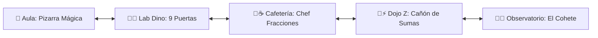

# 🤖 ARA BOT de Mate • PWA Mundo Toca Boca & 5 Minijuegos Escolares

> **Plataforma interactiva de mundo abierto estilo Toca Life / Avatar World con desplazamiento horizontal panorámico, cajón de personajes y mascotas (Nonina 🌸, Doydo 💙, Lolita la coneja 🐰, Gatita 🐱, Bruno el Border Collie 🐶 y ARA BOT 🤖), física de comida masticable y 5 minijuegos temáticos dedicados por área.**  
> **Disponible online y 100% offline en [https://coloapp.github.io/Juegos_Escolares/](https://coloapp.github.io/Juegos_Escolares/)**

---

## 🗺️ 1. Mundo Panorámico con 5 Minijuegos Dedicados por Área

### 1. 🏫 Aula Cuántica: "El Duelo de la Pizarra Mágica"
- **Foco Pedagógico:** 1.° a 3.er Grado • Cálculo mental flash, operaciones básicas y tablas de multiplicar.
- **Mecánicas:** Pizarrón interactivo con tizas de colores, operaciones flash (➕ Sumas, ➖ Restas, ✖️ Tablas), racha de combos 🔥 y estrellas.
- **Acceso:** Botón en la cabecera del aula o tocando el pizarrón.

### 2. 🧪🦖 Lab Dino & Bio-Robótica: "Laboratorio Dinosaurio (Escape del T-Rex)"
- **Foco Pedagógico:** 2.° Grado • Descomposición de centenas, decenas y unidades (C, D, U) y valor del cero.
- **Mecánicas:** **9 Puertas de contención reales** (`378, 642, 195, 814, 250, 937, 409, 763, 581`), 3 búnkers tácticos con auto-bloqueo 🔒, reactor de fusión Base-10 (10 azules ➔ 1 verde, 10 verdes ➔ 1 rojo), azote de compuerta de titanio 💥, rugido del T-Rex y la Lección Secreta del Cero de ARA BOT.
- **Acceso:** Botón en la cabecera o tocando la jaula/mesa del dinosaurio.

### 3. 🥪☕ Cafetería Escolar: "La Cafetería Fraccionaria & Máquina de Bocadillos"
- **Foco Pedagógico:** 2.° y 3.er Grado • Fracciones visuales (1/2, 1/4, 2/4, 3/4) y conteo de dinero en monedas ($10, $5, $1).
- **Mecánicas:** Clientes en mesa (Nonina, Doydo, Lolita, Gatita, Bruno) solicitan porciones de pizza o compras en máquina expendedora, con estrellas de chef y comida servida.
- **Acceso:** Botón en la cabecera o tocando la vitrina de bocadillos.

### 4. 🥊⚡ Gimnasio & Dojo Z: "El Cañón de Sumas RÁPIDAS (Luchadores Z)"
- **Foco Pedagógico:** 2.° Grado • Sumas hasta 50⚡ y pensamiento táctico.
- **Mecánicas:** Modos **⚡ Rápido** (proyectiles cronometrados) y **🧠 Estrategia** (cañón de carga táctica +10, +5, +1), robots enemigos (Chispas, Bípode, Titán, Alfa), combo multiplier y explosión de tuercas ⚙️💥.
- **Acceso:** Botón en la cabecera o tocando el saco de boxeo/dummy.

### 5. 🚀🌌 Observatorio Espacial: "El Cohete Numérico"
- **Foco Pedagógico:** 3.er Grado • Series de 5 en 5, valor posicional de 4 cifras (M, C, D, U).
- **Mecánicas:** Odómetro de 4 cifras (🟡 Millar, 🔴 Centena, 🔵 Decena, 🟢 Unidad), altímetro espacial a 10,000 M, selector de saltos (+1, +2, +5, +10, +50, +100), fábrica Base-10 con portal mágico de partículas y despegue con desglose posicional de ARA BOT.
- **Acceso:** Botón en la cabecera o tocando el cohete de lanzamiento.

---

## 🎒 2. Cajón de Inventario, Mascotas & Física Toca Boca

- **🧸 Objetos & Comida:** Zanahoria 🥕, Pescadito 🐟, Huesito 🍖, Pizza 🍕, Dona 🍩, Jugo 🧃, Helado 🍦, Peluche 🧸, Balón 🏀.
- **👄 Física de Comer:** Arrastra la comida hacia cualquier personaje o mascota para ver la animación de masticar, sonido 'ñam ñam' y corazones flotantes.
- **🐾 Mascotas & Personajes:**
  - **Nonina 🌸:** Romina de 3.er Grado.
  - **Doydo 💙:** Ricardo de 2.º Grado.
  - **Lolita 🐰:** Conejita blanca y tierna.
  - **Gatita 🐱:** Gata blanca con negro y ojos esmeralda.
  - **Bruno 🐶:** Perro Border Collie (pecho blanco, pelaje negro, pata delantera izquierda blanca).
  - **ARA BOT 🤖:** Robot asistente matemático.

---

## 🔄 3. Actualización Automática Diaria (Network-First)

- Detección automática en segundo plano mediante `version.json` sin recargas en bucle.
- Purgado de caché y actualización instantánea con notificación flotante.

---

## 👨‍👧‍👦 Dedicatoria

Creado con amor para **Romina (Nonina)** y **Ricardo (Doydo)**. ¡Aprender matemáticas jugando en su propio mundo escolar interactivo! 🏫🚀🦖🥊🥪
