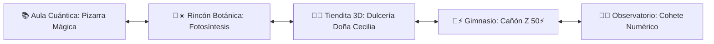
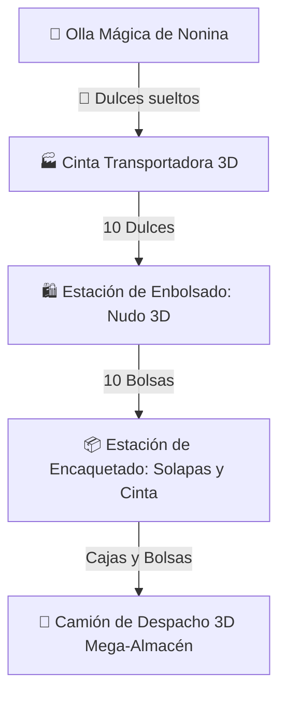

# 🤖 ARA BOT de Mate • PWA Mundo Toca Boca & Juegos Escolares (v5.4.1)

> **PWA interactiva de mundo abierto escolar estilo Toca Life / Avatar World con personajes interactivos arrastrables (Nonina 🌸, Doydo 💙, ARA BOT 🤖, Lolita 🐰 y Bruno 🐶) con física de alimentación animada (mordiscos, migajas y sonidos de masticación), Rincón de Fotosíntesis 🌿☀️, La Dulcería 3D Isométrica de Doña Cecilia 🍬 (estilo Roblox/Overcooked con Odómetro Gigante de Bodega e Inventario, cinta transportadora, empaque en vivo y Retos SEP 2.° Grado), Menú de Hexágonos Neón ⬢ y minijuegos temáticos.**  
> **Disponible online y 100% offline en [https://coloapp.github.io/Juegos_Escolares/](https://coloapp.github.io/Juegos_Escolares/)**

---

## 🏫 1. Mundo Abierto Interactivo (Patio Escolar Panorámico)

El patio cibernético cuenta con desplazamiento horizontal fluido (`touch-pan-x`) y 5 áreas temáticas conectadas:

### 🌿☀️ Rincón de Botánica (Misión Fotosíntesis)
- **Foco Pedagógico:** Ciencias Naturales y Biología Primaria.
- **Mecánica Interactiva:** Experimento interactivo donde el alumno riega la planta con la regadera mágica 💧 y la expone a la luz solar nutritiva ☀️ para completar la reacción química:  
  $$\text{Agua } (\text{H}_2\text{O}) + \text{Luz Solar} + \text{Dióxido de Carbono } (\text{CO}_2) \longrightarrow \text{Glucosa } (\text{Nutrientes 🍯}) + \text{Oxígeno } (\text{O}_2 \text{ 🫧})$$
- Genera partículas de oxígeno y energía vegetal con retroalimentación inmediata de ARA BOT 🤖.

### 🍬🏪 Puesto de Dulces 3D de Doña Cecilia
- Puesto físico en el patio para entrar directamente a la cocina/taller isométrica 3D.

---

## 🍬 2. La Dulcería Isométrica 3D de Doña Cecilia (Estilo Roblox / Overcooked)

Taller de producción interactivo en perspectiva 3D isométrica (`perspective: 1000px`, `transform-style: preserve-3d`) para dominar el valor posicional:

### ✨ Estaciones de Trabajo 3D:
1. **🍯 Olla Mágica de Nonina:** Cocina caramelos en vivo con burbujas y vapor de azúcar animado (`animate-sweet-steam`).
2. **🏭 Cinta Transportadora:** Dulces rodando en 3D con sonido sintetizado `playCandyPop()`.
3. **🛍️ Estación de Embolsado:** 10 Dulces sueltos se unen automáticamente cerrando la bolsa con lazo y nudo 3D.
4. **📦 Estación de Encartonado:** 10 Bolsas forman 1 Caja cúbica 3D que cierra sus 4 solapas (`flap-top/bottom/left/right`) y se sella con cinta de embalaje.
5. **🔢 Odómetro Gigante de Bodega e Inventario:** Visualizador arcade en 3 columnas de gran tamaño (📦 Cajas $\times 100$, 🛍️ Bolsas $\times 10$, 🍬 Dulces $\times 1$) con subtotales en vivo y cálculo del gran total acumulado.
6. **🤖 Odómetro Holográfico Base-10 ARA BOT:** Desglose en tiempo real con equivalencias (ej. $15 \text{ Bolsas} = 1 \text{ Caja} + 5 \text{ Bolsas} = 150 \text{ Dulces}$).
6. **📋 Los 5 Retos SEP de Doña Cecilia:**
   - **Reto 1 (Contar Empacados):** 3 Cajas y 6 Bolsas $\rightarrow \mathbf{360 \text{ dulces}}$.
   - **Reto 2 (Descomponer Pedido):** Pedido de 520 dulces $\rightarrow \mathbf{5 \text{ Cajas y } 2 \text{ Bolsas}}$.
   - **Reto 3 (Agrupar Decenas):** 45 Bolsas $\rightarrow \mathbf{4 \text{ Cajas y } 5 \text{ Bolsas (450 dulces)}}$.
   - **Reto 4 (Conteo de Bodega):** 6 Cajas y 15 Bolsas $\rightarrow \mathbf{750 \text{ dulces en total}}$.
   - **Reto 5 (Mega-Almacén Camión 🚚):** Cargar **1,350 dulces** para el camión foráneo $\rightarrow \mathbf{13 \text{ Cajas (1,300)} + 5 \text{ Bolsas (50)}}$ con animación de salida del camión y claxon realista 📯.

---

## 🌌 3. Menú de Juegos de Doydo (Hexágonos Flotantes Neón ⬢)

Modal holográfico con hexágonos táctiles para **2.° Grado (Ricardo / Doydo)**:

### 🟢 Hexágono 1: "Laboratorio Dinosaurio (Escape del T-Rex 🦖)"
- **Foco:** Descomposición Base-10 (Centenas 🔴, Decenas 🟢, Unidades 🔵) y el Valor Posicional del Cero.
- **Mecánica:** 9 Puertas de contención (`378, 642, 195, 814, 250, 937, 409, 763, 581`), 3 búnkers con auto-bloqueo 🔒, compuertas de titanio 💥 y reactor de fusión Base-10.

### 🔴🔵 Hexágono 2: "El Cañón de Sumas RÁPIDAS (Luchadores Z) 🥊"
- **Foco:** Sumas y cálculo mental rápido con fuerzas hasta 50⚡.
- **Mecánica:** Modos ⚡ Rápido y 🧠 Estrategia (cargas de +10, +5, +1), enemigos robóticos (Chispas Z-1, Cyber-Bípode Z-2, Mecha-Titan Z-3, Electro-Destructor Z-4, Mega-Bot Alfa Z-5) y explosión de tuercas ⚙️💥.

### 🟡 Hexágono 3: "La Dulcería Isométrica 3D de Doña Cecilia 🍬"
- Acceso directo a la fábrica de dulces 3D y simulador de empaque SEP.

---

## 🚀 4. Menú de Juegos de Nonina (3.er Grado)

Modal para **Romina / Nonina**:
- 🌸 **El Cohete Numérico 🚀:** Series de 5 en 5, odómetro de 4 cifras (🟡 Millares, 🔴 Centenas, 🔵 Decenas, 🟢 Unidades) y altímetro espacial a 10,000 M.
- 📐 **Pizarra Mágica Cuántica:** Cálculo mental flash, tizas de colores, sumas, restas y tablas de multiplicar con multiplicador de combo.

---

## 🐾 5. Personajes Interactivos y Sistema de Alimentación Animada

- **Nonina 🌸:** Avatar animado con uniforme escolar y lazo rosa.
- **Doydo 💙:** Avatar animado con gorra azul y rayo relámpago.
- **ARA BOT 🤖:** Robot flotante que brinda pistas pedagógicas.
- **Lolita 🐰:** Conejita con orejas tiernas.
- **Bruno 🐶:** Border Collie fiel con pecho blanco y pata delantera blanca.
- **🍖 Sistema de Alimentación Animada en 4 Etapas:**
  - Al arrastrar o dar clic en un alimento de la mochila (🍬 Dulces, 🍕 Pizza, 🥕 Zanahorias, 🍖 Hueso de Carne, 🍦 Helado, 🍩 Dona, 🍎 Manzana, 💧 Agua):
  - **Animación de mordiscos progresivos:** Alimento entero (100%) $\rightarrow$ 1.ᵉʳ mordisco (60%) $\rightarrow$ 2.° mordisco (20%) $\rightarrow$ deglución (0%).
  - **Física de partículas de migajas (crumbs):** Explosión de migajas coloridas saliendo de cada mordisco.
  - **Audio sintetizado Web Audio API:** Sonidos de masticación crujiente (crunch) sincronizados con cada bocado y trago final.
  - **Animación de masticación facial (`animate-eat-chomp`):** Los personajes abren y cierran la boca, saltan de alegría, emiten corazones flotantes `💖`, destellos `✨` y globos de diálogo personalizados.

---

## 🛠️ 6. Requisitos Técnicos y Arquitectura PWA

- **Single Screen Zero-Scroll View:** Vista fija en `100dvh` optimizada para tablets y smartphones sin desbordamiento vertical.
- **CSS3 3D Preserved Perspective:** Renderizado isométrico ligero por hardware sin librerías externas pesadas.
- **100% Offline (Web Audio API):** Síntesis de ondas de sonido senoidales/cuadradas generadas directamente en el navegador sin dependencias de archivos externos.
- **Auto-Update Engine (Network-First):** Verificación automática de `version.json` con purgado de Service Worker y actualización instantánea.

---

## 👨‍👧‍👦 Dedicatoria

Creado con amor para **Romina (Nonina)** y **Ricardo (Doydo)**. ¡Aprender jugando en su propio universo escolar interactivo! 🏫🌸💙
